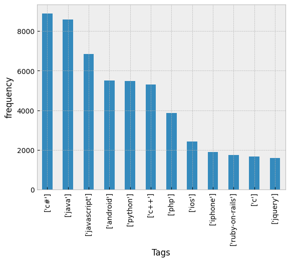

# Automatic-Questions-Tagging-System
Automatic Questions Tagging System
# This project is to tag a question on stackoverflow  automatically given the question  and the answers of it
## we will use the dataset "StackSample:10% of Stack Overflow Q&A" 

LINK : 

[Dataset](https://www.kaggle.com/datasets/stackoverflow/stacksample)

we use the questions and the tags data.A text classification model that analyzes a textual comment and predicts multiple labels associated with the questions. We will implement a tag suggestion system using Multi-Label Text Classification which is a subset of multiple output model.

The system is taking the most possible tag , but we can make it take the most 3 possible tags  to give the question multi label 

## Analysis : 

As seen in figure 

These are the most tags in data and it looks unbalanced.

## Processing : 
- We removed stop words based on analysis of most occurnces words as c# is not stop word in this context.
- Applied stemming and lemmitization.
- TF-IDF as feature extraction.
## Modeling : 
- Artifical neural network and KNN model were used.
## Application : 
Integrating the model into web application or social media app that automatically tags questions to find it easy later.

